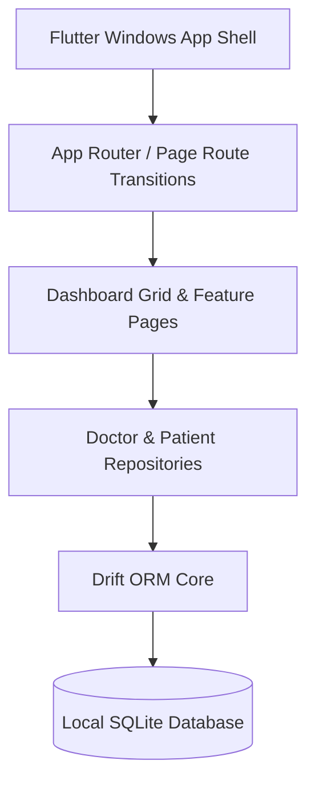

<div align="center">


#  PROJECT WISTERIA
### *Next-Generation Clinical AI Workstation & Desktop Hub*

[](https://flutter.dev)
[](https://microsoft.com/windows)
[](https://drift.simonbinder.eu/)
[](https://github.com)
[](https://github.com)

</div>

---

##  Overview

**Wisteria** is a high-performance, local-first clinical workstation built for Windows Desktop. Blending the immersive visual language of modern game dashboards with enterprise-grade medical record management, Wisteria provides clinicians and medical researchers with a fluid, distraction-free environment for patient management, diagnostic history tracking, and AI model orchestration.

---

##  Key Features

| Feature | Description |
| :--- | :--- |
| ** Game Dashboard UX** | Staggered grid cards with ambient glow, fluid hover scale animations, and intuitive layout hierarchy. |
| ** Patient Directory** | Full CRUD workstation for patient demographics, medical history, active diagnoses, and consultation notes. |
| ** Practitioner Identity** | Doctor profile management with qualification tracking, medical license registry, and department affiliation. |
| ** Clinical AI Engine** | Integrates diagnostic AI workflows including radiology analysis, model run telemetry, and predictive metrics. |
| ** Local-First Engine** | Zero-latency relational data storage using **Drift ORM** over **SQLite**, guaranteeing total patient data privacy. |
| ** Bespoke Dark Aesthetics** | Engineered with deep violet & indigo tokens (`#0F0D1A`), high contrast typography, and custom micro-interactions. |

---

##  Interface Highlights

- **Hero Navigation Hub**: Quick-access cards for active modules with dynamic dynamic grid spacing.
- **Fluid Page Navigation**: Smooth cross-fade page transitions with custom back button integration.
- **Data Integrity**: Powered by strongly-typed Dart code generation via `drift_dev`.

---

##  Tech Stack & Architecture



- **Framework**: [Flutter](https://flutter.dev) (Windows Desktop runner)
- **Database / ORM**: [Drift](https://drift.simonbinder.eu/) (^2.35.0) & `drift_flutter`
- **Architecture**: Modular Feature-First Layered Architecture (Presentation -> Repositories -> Database DAO)
- **Styling**: `WisteriaTheme` design tokens with Inter/Material typography and dark mode surfaces

---

##  Project Structure

```
wisteria/
├── assets/                  # High-res graphics & media assets
│   └── wisteria_banner.png
├── lib/
│   ├── main.dart            # Application entry point & theme initialization
│   ├── app_shell.dart       # Main window layout, sidebar, & router state
│   ├── core/
│   │   ├── database/        # Drift database tables, generated code, repositories
│   │   │   ├── database.dart
│   │   │   ├── tables.dart
│   │   │   └── repositories/ # PatientRepository & DoctorRepository
│   │   └── theme/           # WisteriaTheme custom dark design tokens
│   └── features/            # Feature modules
│       ├── dashboard/       # Dashboard staggered card grid & widgets
│       ├── doctor_profile/  # Doctor profile editor & credentials view
│       ├── patients/        # Patient list, registration, & detail breakdown
│       └── shared/          # Reusable UI widgets (WisteriaBackButton, Placeholders)
└── pubspec.yaml             # Dependencies & asset configuration
```

---

##  Getting Started

### Prerequisites

Ensure you have the following installed on your Windows machine:
- **[Flutter SDK](https://docs.flutter.dev/get-started/install)** (`>= 3.12.1`)
- **[Visual Studio 2022](https://visualstudio.microsoft.com/)** with *Desktop development with C++* workload enabled.

### Installation

1. **Clone the repository**:
   ```bash
   git clone https://github.com/YourUsername/wisteria.git
   cd wisteria
   ```

2. **Install dependencies**:
   ```bash
   flutter pub get
   ```

3. **Generate Drift Database Code** *(if modifying tables)*:
   ```bash
   dart run build_runner build --delete-conflicting-outputs
   ```

4. **Run the Application on Windows**:
   ```bash
   flutter run -d windows
   ```

---

##  Database Schemas (Drift ORM)

Wisteria maintains 17 strongly-typed relational tables for local telemetry and records:
- **`DoctorProfiles`**: Clinician identities, credentials, department.
- **`Patients`**: Core patient demographic data and active case notes.
- **`PreviousMedicalInformations` & `PreviousMedications`**: Historical health records.
- **`MedicalModels` & `ModelVersions`**: AI model registry and versioning.
- **`ModelRuns` & `AiAnalyses`**: Execution history, diagnostic findings, and confidence scores.

---

##  Design System Tokens

Wisteria features a curated color palette built specifically for low-light clinical environments:

| Token Name | Hex Code | Visual Sample | Application |
| :--- | :--- | :--- | :--- |
| **Dark Background** | `#0F0D1A` | ⬛ | Application root background |
| **Card Surface** | `#1A162B` | 🟪 | Dashboard modules & containers |
| **Primary Accent** | `#818CF8` | 🟦 | Primary buttons, active tab indicators |
| **Electric Indigo** | `#6366F1` | 🟣 | Interactive hover states, glowing borders |
| **Soft Violet** | `#A78BFA` | 💜 | Secondary text highlights & icons |

---

##  License

Distributed under the MIT License. See `LICENSE` for more information.

<div align="center">

**Built with ❤️ for Modern Clinical Workflows**

</div>

