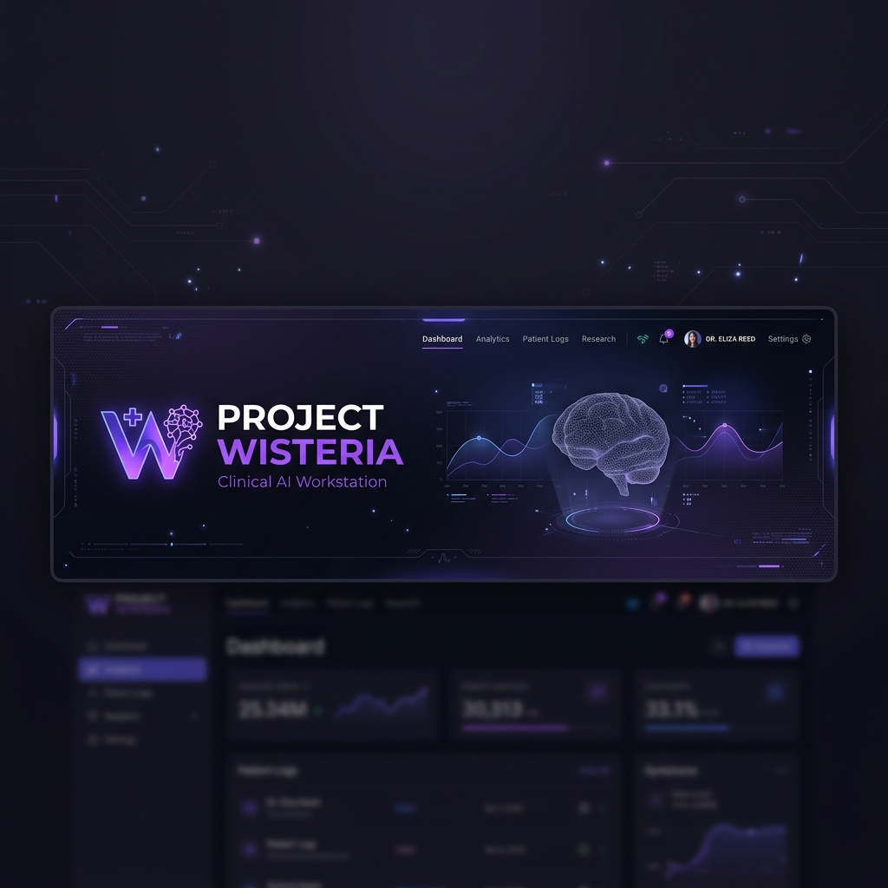
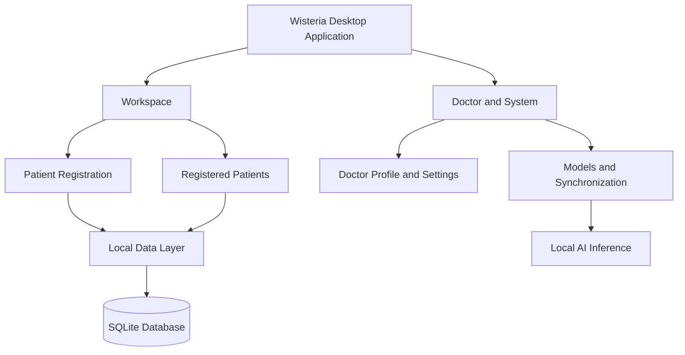

 <div align="center">



# 🌸 PROJECT WISTERIA

### *An Offline-First Clinical AI Workstation*

A doctor-centric desktop application for patient records, medical imaging, and AI-assisted clinical workflows.

[](https://flutter.dev/)
[](https://learn.microsoft.com/en-us/windows/)
[](https://drift.simonbinder.eu/)
[](https://onnxruntime.ai/)
[](https://github.com/FazilPRaphi/Wisteria)

</div>

---

 ## Overview

**Wisteria** is an offline-first, doctor-centric clinical desktop application designed to bring patient information, medical records, medical imaging, and AI-assisted analysis into one workspace.

Built with Flutter, Wisteria aims to support clinicians in managing patient information and accessing locally available AI models without requiring continuous internet connectivity for core offline workflows.

The application combines local data management with a modular design that can support different medical analysis workflows. AI-generated findings are intended to assist clinical review rather than replace a healthcare professional's judgement.

 ## Key Features

| Feature | Description |
|---|---|
 | Doctor Profile | Manage doctor profile and professional or clinic information. |
 | New Patient | Register patient information and create patient records. |
 | Registered Patients | Browse and manage existing patient records. |
 | Medical AI Models | Access the application's locally available AI models and related functionality. |
 | Medical Imaging | Support medical-image workflows for compatible image formats and analysis models. |
 | Settings | Configure available application preferences, including the visual theme. |
 | Synchronization | Provide a dedicated area for data synchronization functionality. |
 | Local Data Management | Use SQLite with Drift for structured local data storage. |
 | Offline-First Workflows | Support core workflows locally where the required data and models are installed. |

> **Development note:** Wisteria is an academic project under active development. The availability of individual features depends on their current implementation.

 ## Interface Preview

Wisteria uses a clean, desktop-first interface designed around rectangular image cards, clear typography, and minimal navigation.

 ### Workspace

The Workspace screen provides quick access to the two primary patient actions:

- **New Patient** — register a new patient record.
- **Registered Patients** — browse and search the patient directory.

 ### Doctor & System

A dedicated section groups the supporting application areas:

- Doctor Profile
- Settings
- Models
- Synchronization

 ### Light and Dark Themes

Wisteria supports a dark clinical interface and a light interface with a softer, neutral background.

Both themes share the same layout, with carefully balanced colours and contrast to keep labels, descriptions, and actions readable.

 ## Design System

Wisteria uses a restrained clinical colour palette with navy surfaces, rose-pink accents, and teal-blue highlights.

### Dark Mode

| Colour | Hex | Usage |
|---|---|---|
 | Deep Navy | `#111923` | Main application background |
 | Dark Surface | `#1C2934` | Navigation and supporting surfaces |
 | Rose Pink | `#C96A83` | Primary highlights and selected actions |
 | Teal Blue | `#0796AF` | Secondary actions and informational highlights |
 | Soft White | `#F1F5F7` | Primary text |
 | Muted Blue-Gray | `#A6B5C1` | Secondary text |

### Light Mode

| Colour | Hex | Usage |
|---|---|---|
 | Soft Off-White | `#F1F5F5` | Main application background |
 | White Surface | `#FFFFFF` | Cards and content surfaces |
 | Rose Pink | `#C96A83` | Primary highlights and selected actions |
 | Teal Blue | `#0796AF` | Secondary actions and informational highlights |
 | Dark Navy | `#202B35` | Primary text |
 | Muted Blue-Gray | `#718493` | Secondary text |

*These values document the intended visual palette and should be aligned with the final theme constants in the Flutter code.*

### Design Principles

 - Clear navigation without a sidebar.
 - Relevant photographic assets for key sections.
 - Rectangular cards with restrained borders and shadows.
 - Readable text and action labels over image backgrounds.
 - Consistent layouts across light and dark modes.
 - Minimal visual clutter, with colour used to establish hierarchy.

 ## Tech Stack

| Technology | Purpose |
|---|---|
| [Flutter](https://flutter.dev/) | Desktop application UI and framework |
| [Dart](https://dart.dev/) | Application programming language |
| [Drift](https://drift.simonbinder.eu/) | Typed database access and data management |
| [SQLite](https://sqlite.org/) | Local relational database |
| [ONNX Runtime](https://onnxruntime.ai/) | Local inference for compatible ONNX models |
| [PyTorch](https://pytorch.org/) | Model development and preparation workflows |
| [Git](https://git-scm.com/) | Version control |
| [GitHub](https://github.com/) | Source-code hosting and collaboration |

 ## Architecture Overview

The application follows a modular approach that separates the user interface, data access, local storage, and AI-related functionality.



*This diagram represents the high-level application concept, not a guarantee that every connection shown is fully implemented.*

 ## Project Structure

The following is a guide to the main project assets and configuration files.

```text
Wisteria/
├── assets/
│   ├── wisteria_banner.png
│   ├── patients.jpg
│   ├── new_patients.jpg
│   ├── registered_patients.jpg
│   ├── doctor.jpg
│   ├── ai_workplace.jpg
│   ├── model.jpg
│   ├── settings.jpg
│   ├── sync.jpg
│   └── models/
│       └── pneumonia_resnet18.onnx
├── lib/
│   └── Application source code
├── test/
│   └── Automated tests
├── windows/
│   └── Windows desktop runner
├── pubspec.yaml
├── pubspec.lock
└── README.md
```

**Note:** The asset names above describe the intended structure. Keep only the filenames that actually exist in your repository, and retain any additional existing assets and source folders. The ONNX model belongs in `assets/models/` and should not be moved or renamed without updating its references in the code.

 ## Getting Started

### Prerequisites

For Windows desktop development, install:

- [Flutter SDK](https://docs.flutter.dev/get-started/install)
- [Git](https://git-scm.com/downloads)
- [Visual Studio](https://visualstudio.microsoft.com/) with the **Desktop development with C++** workload

> Android Studio and the Android SDK are not required just to run the Windows desktop version.

### 1. Clone the Repository

```bash
git clone https://github.com/FazilPRaphi/Wisteria.git
cd Wisteria
```

### 2. Check Flutter Setup

```bash
flutter doctor
```

Resolve any issues related to the Windows desktop development toolchain.

### 3. Install Dependencies

```bash
flutter pub get
```

### 4. Run Wisteria

```bash
flutter run -d windows
```

### 5. Optional: Regenerate Database Code

Only when database definitions or other generated files need updating, run:

```bash
dart run build_runner build --delete-conflicting-outputs
```

 ## Local Data Management

Wisteria uses SQLite with Drift to organise application data locally.

The existing database implementation includes data areas such as:

- **DoctorProfiles** — doctor profile information.
- **Patients** — patient records.
- **MedicalImages** — medical-image metadata.
- **MedicalModels** — information about available models.
- **AiAnalyses** — AI analysis records.
- **FinalReports** — report-related data.

The exact database schema and relationships are defined in the application source code.

 ## Privacy and Offline-First Approach

Wisteria is designed to support local clinical workflows without continuous internet access.

 - Core offline functionality can operate with the necessary local data and models available.
 - Patient data can be stored in the local database.
 - Compatible installed models can support local inference.
 - AI findings should be reviewed by a qualified healthcare professional.

**Important:** Offline operation alone does not guarantee complete data security. Appropriate device security, access controls, backups, and protection of locally stored information remain important.

 ## Contributing

Wisteria is developed collaboratively as an academic project.

To contribute:

1. Fork or clone the repository.
2. Create a separate branch for your changes.
3. Make and test your modifications.
4. Commit your changes with a descriptive message.
5. Push your branch to GitHub.
6. Open a pull request for review.

Please avoid committing patient-identifiable information, credentials, API keys, or other sensitive data.

 ## License

See the repository's `LICENSE` file for the applicable license terms.

---

<div align="center">

 **Built with care for offline-first clinical workflows**

🌸 *Project Wisteria — Bringing patient records and AI-assisted analysis together.*

</div>
